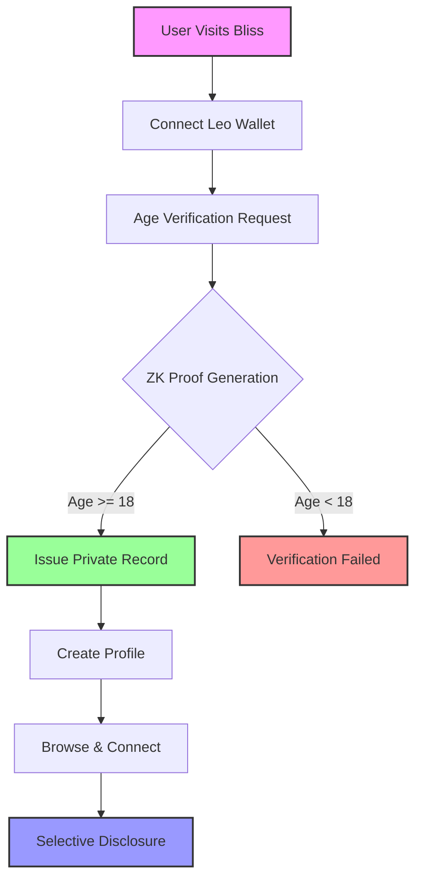
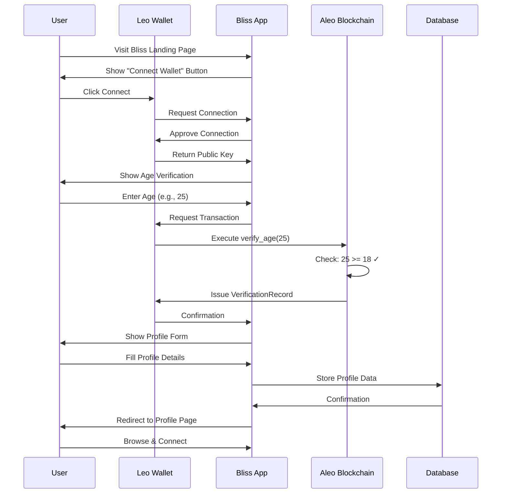
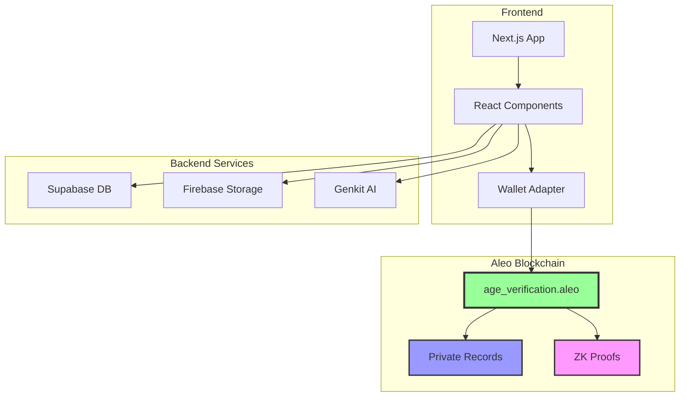

# Bliss - Privacy-First Dating on Aleo

<div align="center">


**Find your vibe, keep your privacy**

[](https://nextjs.org/)
[](https://aleo.org/)
[](https://www.typescriptlang.org/)
[](LICENSE)

[Live Demo](#) • [Documentation](#) • [Report Bug](#) • [Request Feature](#)

</div>

---

## ⚡ Quick Start (2 Minutes)

```bash
git clone https://github.com/yourusername/bliss.git
cd bliss
pnpm install
pnpm dev
```

Open `http://localhost:9002` and connect **Leo Wallet** (Testnet).

**Prerequisites:** Node.js 18+, pnpm, [Leo Wallet extension](https://leo.app/), Aleo testnet tokens

---

## Who Is Bliss For?

- **Users** who want safer, private online dating
- **Developers** learning zero-knowledge apps on Aleo
- **Web2 users** onboarding into Web3 without friction
- **Researchers** exploring privacy-first social applications

---

## Table of Contents

- [The Problem We Solve](#the-problem-we-solve)
- [Why This Can't Be Built Without Zero-Knowledge](#why-this-cant-be-built-safely-without-zero-knowledge)
- [Why Aleo?](#why-aleo)
- [Solution: Bliss](#solution-bliss)
- [How It Works](#how-it-works)
- [Tech Stack](#tech-stack)
- [Smart Contract](#smart-contract)
- [Architecture](#architecture-diagram)
- [Getting Started](#getting-started)
- [Project Structure](#project-structure)
- [Roadmap](#roadmap)
- [Contributing to Aleo Ecosystem](#contributing-to-aleo-ecosystem)
- [Security & Privacy](#security--privacy)
- [License](#license)

---

## The Problem We Solve

Dating today is broken. The statistics paint a concerning picture:

### Safety Crisis
- **91%** of single women in the U.S. worry about safety when dating
- **44%** have felt unsafe on a date
- **78%** of those unsafe dates started online
> Source: [Dating News - Single Women Dating Safety Statistics](https://www.datingnews.com/industry-trends/single-women-dating-safety-statistics/)

### Trust & Verification Issues
- **70%** of women snoop online before meeting someone (vs. only 45% of men)
- **40%** actually find sketchy information:
  - Fake job titles
  - Catfish photos
  - Misleading profiles
> Source: [Security.org - Romance Scams Report](https://www.security.org/digital-safety/scams/romance/)

### Failed Solutions
Other apps tried to solve this problem (like the viral "Tea" app), but fell short due to:
- **Data leaks** exposing sensitive user information
- **Malicious trolls** abusing verification systems
- **Centralized databases** becoming honeypots for hackers
> Reference: [BBC - Tea App Security Issues](https://www.bbc.com/news/articles/c7vl57n74pqo)

---

## Why Aleo?

Bliss leverages **Aleo's zero-knowledge blockchain** to solve privacy and trust issues that plague traditional dating apps:

### Privacy by Design
```
Traditional Apps          →    Bliss on Aleo
━━━━━━━━━━━━━━━━━━━━━━━━━━━━━━━━━━━━━━━━━━━━━━━
Store your age            →    Prove you're 18+ (age never stored)
Public profile data       →    Private credentials as records
Centralized databases     →    Decentralized verification
Trust the company         →    Trust the math (ZK proofs)
```

### Key Aleo Features We Use

1. **Zero-Knowledge Proofs**
   - Verify age without revealing actual age
   - Prove credentials without exposing data
   - Mathematical certainty, not trust

2. **Private Records**
   - Verification credentials stored as Aleo records
   - Only you can access your data
   - No centralized database to hack

3. **On-Chain Privacy**
   - All verifications happen on-chain
   - Transparent process, private data
   - Immutable proof of verification

4. **Decentralization**
   - No single point of failure
   - No company can sell your data
   - You own your identity

---

## Solution: Bliss

Bliss is a **privacy-first dating platform** that uses Aleo's blockchain to enable:

→ **Anonymous Age Verification** - Prove you're 18+ without revealing your age  
→ **Private Profiles** - Share what you want, when you want  
→ **Zero-Knowledge Credentials** - Verify attributes without exposing data  
→ **Decentralized Identity** - You own your data, not us  
→ **Safety First** - Mathematical proofs instead of trust  

### Core Principles

▸ **Privacy by Default** - Your data never leaves your control  
▸ **Selective Disclosure** - Share only what's necessary  
▸ **Cryptographic Trust** - Math over promises  
▸ **Decentralized** - No central authority  

---

## How It Works



### Step-by-Step Process

1. **Wallet Connection**
   - User connects Leo Wallet (Aleo wallet)
   - No email, no password required
   - Wallet address becomes identity

2. **Age Verification (ZK Proof)**
   ```
   Input: User's age (private)
   Process: Leo smart contract verifies age >= 18
   Output: VerificationRecord (private credential)
   Result: Age never stored or revealed
   ```

3. **Profile Creation**
   - User creates profile with chosen information
   - Profile data stored in Supabase (Wave 1)
   - Future: Migrate to fully on-chain storage

4. **Selective Disclosure**
   - Users control what they share
   - ZK proofs for sensitive attributes
   - Privacy-preserving matching

---

## User Flow

### Complete Onboarding Journey



### Visual User Flow

```
┌─────────────────────────────────────────────────────────────────┐
│                        LANDING PAGE                              │
│  "Privacy is the new luxury"                                     │
│  [Connect Wallet Button]                                         │
└────────────────────┬────────────────────────────────────────────┘
                     │
                     ▼
┌─────────────────────────────────────────────────────────────────┐
│                    STEP 1: CONNECT WALLET                        │
│  • Select Leo Wallet                                             │
│  • Approve connection                                            │
│  • Wallet address = Identity                                     │
└────────────────────┬────────────────────────────────────────────┘
                     │
                     ▼
┌─────────────────────────────────────────────────────────────────┐
│                   STEP 2: AGE VERIFICATION                       │
│  • Enter age (stays private)                                     │
│  • ZK proof generated                                            │
│  • On-chain verification                                         │
│  • Private record issued                                         │
└────────────────────┬────────────────────────────────────────────┘
                     │
                     ▼
┌─────────────────────────────────────────────────────────────────┐
│                   STEP 3: CREATE PROFILE                         │
│  • Name & bio                                                    │
│  • Dating intent                                                 │
│  • Interests                                                     │
│  • Profile photo                                                 │
└────────────────────┬────────────────────────────────────────────┘
                     │
                     ▼
┌─────────────────────────────────────────────────────────────────┐
│                   STEP 4: YOU'RE READY!                          │
│  • View profile                                                  │
│  • Browse connections                                            │
│  • Selective disclosure                                          │
└─────────────────────────────────────────────────────────────────┘
```

---

## Tech Stack

### Frontend
- **Next.js 15.1** - React framework with App Router
- **TypeScript** - Type-safe development
- **Tailwind CSS** - Utility-first styling
- **Radix UI** - Accessible component primitives
- **Framer Motion** - Smooth animations

### Blockchain
- **Aleo** - Zero-knowledge blockchain
- **Leo Language** - Smart contract development
- **Leo Wallet Adapter** - Wallet integration
- **@provablehq/sdk** - Aleo SDK for JavaScript

### Backend & Storage
- **Supabase** - Database, authentication & image storage
- **Genkit AI** - AI-powered features (future)

### Development Tools
- **pnpm** - Fast package manager
- **ESLint** - Code linting
- **Prettier** - Code formatting

---

## Smart Contract

### Deployed Contract

**Program ID:** `age_verification.aleo`  
**Network:** Aleo Testnet  
**Deployment Transaction:** `at13x3vucazw9ylwvjkpzjh4ka94k97qyh7yz00te2nz20dfmgwyqfqcgmhjs`

### Contract Functions

#### 1. `verify_age`
```leo
function verify_age(private age: u8) -> VerificationRecord
```
- **Purpose:** Verify user is 18+ years old
- **Input:** User's age (private, never stored)
- **Output:** Private VerificationRecord
- **Privacy:** Age is never revealed or stored on-chain

#### 2. `prove_possession`
```leo
function prove_possession(private record: VerificationRecord) -> bool
```
- **Purpose:** Prove ownership of verification credential
- **Input:** VerificationRecord (private)
- **Output:** Boolean confirmation
- **Privacy:** Record contents never revealed

### Record Structure

```leo
record VerificationRecord {
    owner: address,      // Wallet address
    verified: bool,      // Always true
    _nonce: group,       // Privacy nonce
}
```

### Privacy Guarantees

→ No age data stored on-chain  
→ No personal information in records  
→ Zero-knowledge proof verification  
→ Private credentials as Aleo records  
→ Selective disclosure enabled  

---

## Getting Started

### Prerequisites

- **Node.js** 18+ and pnpm
- **Leo Wallet** browser extension
- **Aleo testnet tokens** (for transactions)
- **Git** for cloning

### Installation

1. **Clone the repository**
```bash
git clone https://github.com/yourusername/bliss.git
cd bliss
```

2. **Install dependencies**
```bash
pnpm install
```

3. **Set up environment variables**
```bash
cp .env.example .env.local
```

Edit `.env.local`:
```env
NEXT_PUBLIC_SUPABASE_URL=your_supabase_project_url
NEXT_PUBLIC_SUPABASE_ANON_KEY=your_supabase_anon_key

NEXT_PUBLIC_ALEO_API_URL=https://api.explorer.provable.com/v1/testnet

# Deployed smart contract program ID
NEXT_PUBLIC_AGE_VERIFICATION_PROGRAM_ID=bliss_age_verification_v1.aleo
```

4. **Run development server**
```bash
pnpm dev
```

5. **Open your browser**
```
http://localhost:9002
```

### Smart Contract Development

Navigate to the contract directory:
```bash
cd contracts/age_verification
```

Build the contract:
```bash
leo build
```

Test the contract:
```bash
# Test valid age
leo run verify_age 25u8

# Test invalid age (should fail)
leo run verify_age 17u8
```

Deploy to testnet:
```bash
leo deploy --network testnet
```

---

## Project Structure

```
bliss/
├── contracts/
│   └── age_verification/          # Leo smart contract
│       ├── src/
│       │   └── main.leo           # Contract code
│       ├── inputs/                # Test inputs
│       └── deployment/            # Deployment info
├── src/
│   ├── app/                       # Next.js app router
│   │   ├── page.tsx              # Landing page
│   │   ├── onboarding/           # Onboarding flow
│   │   └── profile/              # User profile
│   ├── components/
│   │   ├── aleo/                 # Aleo wallet components
│   │   ├── landing/              # Landing page components
│   │   ├── onboarding/           # Onboarding components
│   │   ├── profile/              # Profile components
│   │   └── ui/                   # Reusable UI components
│   ├── lib/
│   │   ├── aleo/                 # Aleo integration
│   │   │   ├── service.ts        # Contract interaction
│   │   │   ├── wallet-provider.tsx
│   │   │   └── types.ts
│   │   └── supabase/             # Database integration
│   └── hooks/                    # React hooks
├── public/                        # Static assets
├── docs/                          # Documentation
├── package.json
├── next.config.ts
├── tailwind.config.ts
└── tsconfig.json
```

---

## Contributing to Aleo Ecosystem

Bliss is built to showcase and grow the **Aleo ecosystem**. Here's how we contribute:

### 1. Real-World Use Case
- Demonstrates practical ZK application
- Shows privacy benefits in consumer apps
- Proves Aleo's scalability for social platforms

### 2. Developer Resources
- Open-source codebase
- Documented smart contracts
- Integration examples
- Best practices for Leo development

### 3. User Adoption
- Onboards non-crypto users to Aleo
- Simplifies wallet interaction
- Demonstrates UX possibilities

### 4. Privacy Advocacy
- Educates users about ZK technology
- Shows alternatives to data-harvesting apps
- Promotes privacy-first development

### How to Contribute

We welcome contributions! Here's how:

1. **Fork the repository**
2. **Create a feature branch** (`git checkout -b feature/amazing-feature`)
3. **Commit your changes** (`git commit -m 'Add amazing feature'`)
4. **Push to the branch** (`git push origin feature/amazing-feature`)
5. **Open a Pull Request**

### Areas We Need Help

- UI/UX improvements
- Additional ZK proof implementations
- Mobile responsiveness
- Testing and QA
- Documentation
- Internationalization

---

## Roadmap

### Wave 1 (Complete)
- [x] Age verification with ZK proofs
- [x] Wallet integration (Leo Wallet)
- [x] Basic profile creation
- [x] Landing page with privacy education
- [x] Smart contract deployment

### Wave 2 (In Progress)
- [ ] Matching algorithm (privacy-preserving)
- [ ] Encrypted messaging
- [ ] Additional verification proofs
  - [ ] Location proximity (without revealing exact location)
  - [ ] Education verification
  - [ ] Employment verification
- [ ] Enhanced profile features

### Wave 3 (Planned)
- [ ] Fully on-chain profiles
- [ ] Decentralized storage integration
- [ ] Token-based features
- [ ] DAO governance
- [ ] Mobile app (iOS/Android)
- [ ] Advanced matching with ZK-ML

### Future Vision
- [ ] Cross-chain identity
- [ ] Reputation system (privacy-preserving)
- [ ] Video verification
- [ ] Event coordination
- [ ] Community features

---

## Architecture Diagram



---

## Security & Privacy

### What We Collect
- **We DON'T collect:** Age, location, browsing history, personal identifiers
- **We DO collect:** Wallet address (public), profile info you choose to share

### Data Storage
- **On-Chain:** Verification proofs (zero-knowledge, no personal data)
- **Off-Chain:** Profile data (encrypted, user-controlled)
- **Local:** Wallet keys (never leave your device)

### Privacy Features
- Zero-knowledge age verification
- Private credential records
- Selective disclosure
- Encrypted communications (Wave 2)
- No tracking or analytics

---

## License

This project is licensed under the MIT License - see the [LICENSE](LICENSE) file for details.

---

## Acknowledgments

- **Aleo Team** - For building the privacy-first blockchain
- **Leo Language** - For making ZK development accessible
- **Demox Labs** - For the wallet adapter
- **Community** - For feedback and support

---

## Contact & Community

- **Website:** [bliss-dating.vercel.com](#)
- **Email:** jayantkurekar1@gmail.com

---

<div align="center">

**Built with ❤️ on Aleo**

*Privacy is not a feature, it's a fundamental right*

[⬆ Back to Top](#bliss---privacy-first-dating-on-aleo)

</div>
