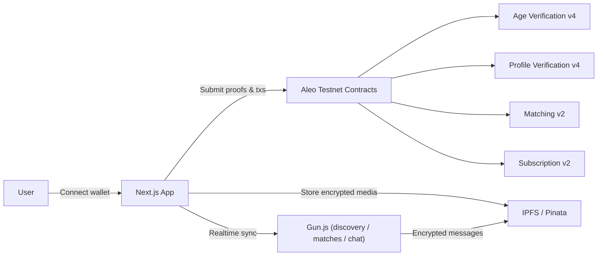
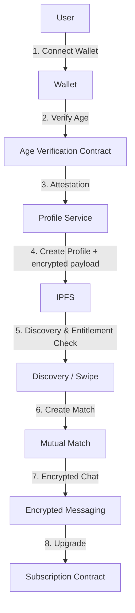

# Bliss — Product Edition

Bliss is a privacy-first, production-grade decentralized dating product combining provable on-chain verification with fast off-chain realtime discovery and encrypted messaging.

[](README.md) [](LICENSE)

Summary: Bliss delivers a consumer-ready dating experience that preserves user privacy while providing verifiable age, entitlement, and subscription state on Aleo.

---

## Table of Contents

- Product snapshot
- Key product features
- How it works (architecture + user flow)
- Security & privacy
- Getting started (user & developer)
- Deployment & production notes
- Changelog & support

---

## Product snapshot

| Status | Release | Network | Source of truth |
|---:|:---:|:---:|:---|
| Production-ready (Testnet) | v1.0 | Aleo Testnet | [contracts/deployment-artifacts/deployment-summary-testnet.json](contracts/deployment-artifacts/deployment-summary-testnet.json)

Bliss is intended for real users and operator-managed deployments. Contracts for age verification and profile verification are upgraded to `v4`; matching and subscription systems are on `v2` for this release.

---

## Key product features

- **Privacy-first by default:** End-to-end encrypted messages and encrypted profile/media storage on IPFS.
- **Verifiable age checks:** Provider-attested, quorum-verified age attestations on-chain (`bliss_age_verification_v4.aleo`).
- **Profile lifecycle with age bridge:** Create and update profiles with cryptographic age-bridging payloads for safety and auditability.
- **Entitlement-backed swipes:** Swiping consumes on-chain entitlements with deferred settlement and retry/backoff for client resilience.
- **Match unlocking & secure chat:** Mutual matches unlock an encrypted chat channel synchronized via Gun.js.
- **Subscription gating:** On-chain subscription state controls premium features and entitlement issuance.
- **Operator-ready controls:** Signed IPFS routes, replay protection, and Redis-backed rate limiting for production safety.

---

## How it works — architecture

High level architecture (two execution planes): on-chain for verifiable state, off-chain for realtime UX and storage.


```mermaid
flowchart LR
  U["User"] -->|Connect wallet| C["Next.js App"]
  C -->|Submit proofs & txs| AC["Aleo Testnet Contracts"]
  AC --> AV["Age Verification v4"]
  AC --> PV["Profile Verification v4"]
  AC --> MM["Matching v2"]
  AC --> SA["Subscription v2"]
  C -->|Realtime sync| G["Gun.js (discovery / matches / chat)"]
  C -->|Store encrypted media| IPFS["IPFS / Pinata"]
  G -->|Encrypted messages| IPFS
```

User flow (end-to-end):


```mermaid
flowchart TD
  U["User"] -->|1. Connect Wallet| W["Wallet"]
  W -->|2. Verify Age| AV["Age Verification Contract"]
  AV -->|3. Attestation| P["Profile Service"]
  P -->|4. Create Profile + encrypted payload| IPFS["IPFS"]
  IPFS -->|5. Discovery & Entitlement Check| D["Discovery / Swipe"]
  D -->|6. Create Match| M["Mutual Match"]
  M -->|7. Encrypted Chat| Chat["Encrypted Messaging"]
  Chat -->|8. Upgrade| S["Subscription Contract"]
```

---

## Security & privacy

- **End-to-end encryption** for chat content; profiles and media are stored encrypted on IPFS.
- **Signed request proofs** protect IPFS routes (`upload-json`, `upload-image`, `unpin`).
- **Replay nonce protection** and Redis-backed replay tracking for production deployments.
- **Rate limiting** for sensitive endpoints (per-IP and per-wallet) to mitigate abuse.
- **Provable on-chain attestations** for age and subscription state — verifiable on-chain history for auditability.

---

## Getting started

User quickstart (run locally):

```bash
npm ci
cp .env.example .env
npm run dev
# Open http://localhost:9002
```

Developer / operator quickstart:

```bash
npm run ci:verify         # run preflight checks (typecheck, lint, build gates)
npm run contracts:build   # compile Aleo programs
npm run contracts:deploy  # deploy to configured network (testnet)
```

App entrypoint: `src/app/page.tsx` — the Next.js App Router powers the client flows and API routes.

---

## Deployment & production notes

- Source of truth for deployed artifacts: [contracts/deployment-artifacts/deployment-summary-testnet.json](contracts/deployment-artifacts/deployment-summary-testnet.json).
- Important deployments (Aleo Testnet):

| Contract | Program ID | Explorer |
|---|---|---|
| Age Verification | `bliss_age_verification_v4.aleo` | https://explorer.provable.com/transaction/at1wuwhrcrtvugf7hpcndehatuhg8ykacrkt7n83a23dg39xjw8pvqqj24ldc |
| Profile Verification | `bliss_profile_verification_v4.aleo` | https://explorer.provable.com/transaction/at1z9yeywk58tqjs8fsxq6rndezta39ns4ajr2p3s93p5c8pkutwcgsd4f0xq |
| Compatibility Matching | `bliss_compatibility_matching_v2.aleo` | https://explorer.provable.com/transaction/at1y3kays34gprdnhlqgvts4qgphwaf3t7eg4hj5l8em7wje9h0qqrq5wnuex |
| Subscription Access | `bliss_subscription_access_v2.aleo` | https://explorer.provable.com/transaction/at1hzndqn298fuslk7nvll7z79p5v6avtjagaxgrx9dxrspqzymlgzsylgray |

Production checklist:

- Redis for replay protection & rate limiting
- Pinata (or alternative) for IPFS pinning with signed-proof checks
- Monitoring on server routes and Aleo contract interactions

---

## Changelog (high level)

- v1.0 — Production release (Testnet): Age + Profile v4, Matching + Subscription v2, full product QA and preflight gates.

---

## Support & feedback

For issues, feature requests, or enterprise inquiries open a GitHub issue or contact the maintainers via the repo.

If you'd like, I can also:

- Add product screenshots and a hosted demo page
- Generate a short press/product one-pager or slide deck

Would you like me to add screenshots or produce a short product one-pager next?

---

## Contributing

We welcome contributions. Please run `npm run ci:verify` locally before opening a PR.

---

## License

MIT
