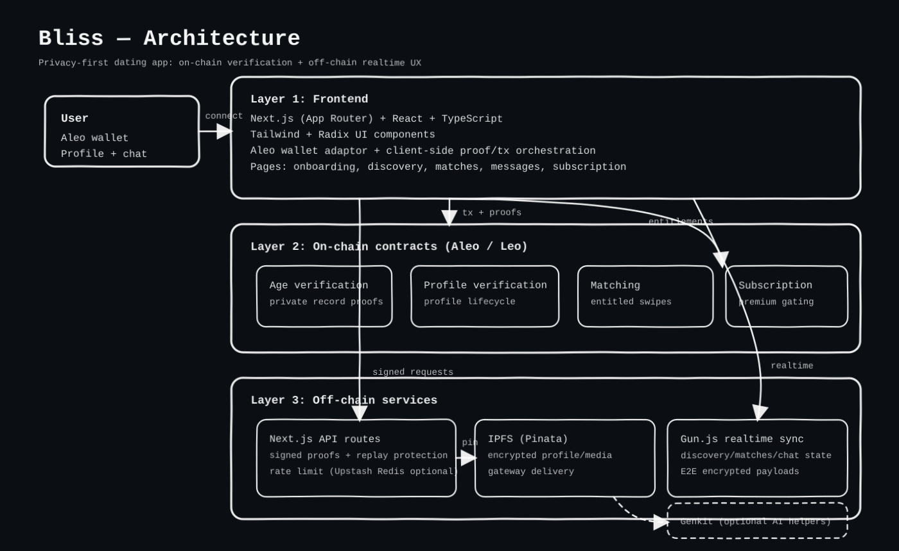
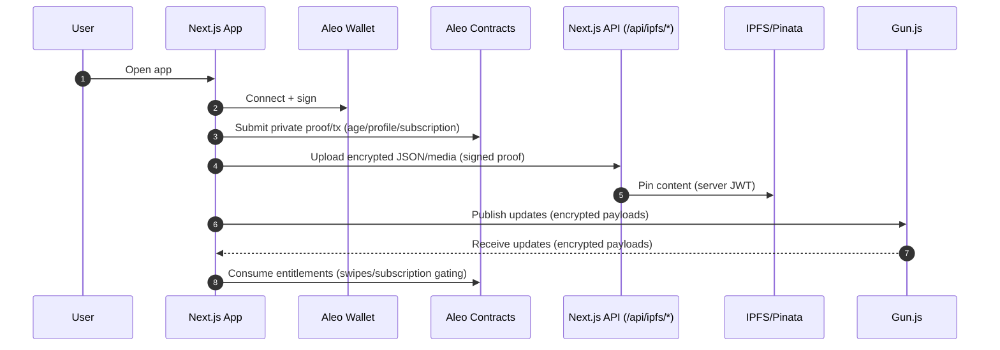

<p align="center">
  
</p>

<h1 align="center">Bliss</h1>

<p align="center"><strong>Production-ready • Aesthetic UI • Next.js 15 • Aleo (Leo) • IPFS (Pinata) • Gun.js</strong></p>

Bliss is a privacy-first dating app built for a consumer-grade UX without leaking sensitive user data.
It uses Aleo smart contracts for verifiable state (age, profile validity, subscription/entitlements).
Encrypted profile data and media live off-chain on IPFS, pinned via server-side routes.
Realtime discovery, matches, and messaging are synchronized through Gun.js using encrypted payloads.
The result is fast UX with verifiable safety controls and minimal public metadata.

## Bliss architecture



## Features

### Core Capabilities

- Wallet-based onboarding and on-chain verification primitives
- Age verification and profile lifecycle verification on Aleo
- Entitlement-backed swipes and subscription gating
- Encrypted profile storage and media uploads via IPFS (Pinata)
- Realtime discovery/match state and encrypted messaging sync via Gun.js

### User Experience

- Mobile-first Next.js UI with responsive discovery/matches/messages flows
- Fast realtime updates (discovery + chats) with minimal loading friction
- Private-by-default data handling (encrypted payloads; server JWT never in browser)

## Architecture

### Layer 1: Frontend

- Next.js (App Router) + React + TypeScript
- Tailwind CSS + Radix UI component primitives
- Aleo wallet adaptor for signing, proof/tx submission, and session state

### Layer 2: Contracts

- Aleo / Leo programs under `contracts/`
- Programs (configured via env): age verification, profile verification, matching, subscription access
- On-chain records store verifiable state; encrypted user content remains off-chain

### Layer 3: Backend (off-chain services)

- Next.js Route Handlers under `src/app/api/` for IPFS pinning and safety controls
- Signed upload proofs + replay protection + rate limiting (Upstash Redis REST if configured)
- IPFS (Pinata) as encrypted profile/media persistence layer
- Gun.js for realtime sync of discovery, matches, and chat metadata (encrypted payloads)

## Data Flow: diagram


```mermaid
sequenceDiagram
  autonumber
  participant U as User
  participant FE as Next.js App
  participant W as Aleo Wallet
  participant AC as Aleo Contracts
  participant API as Next.js API (/api/ipfs/*)
  participant IPFS as IPFS/Pinata
  participant G as Gun.js

  U->>FE: Open app
  FE->>W: Connect + sign
  FE->>AC: Submit private proof/tx (age/profile/subscription)
  FE->>API: Upload encrypted JSON/media (signed proof)
  API->>IPFS: Pin content (server JWT)
  FE->>G: Publish updates (encrypted payloads)
  G-->>FE: Receive updates (encrypted payloads)
  FE->>AC: Consume entitlements (swipes/subscription gating)
```

## Technology Stack

- Blockchain: Aleo, Leo, Provable SDK + wallet adaptor
- Frontend: Next.js 15, React 18, TypeScript, Tailwind CSS, Radix UI
- Backend: Next.js Route Handlers, Pinata API (IPFS), Gun.js realtime, Upstash Redis REST (optional), Genkit (optional)
- Dev tools: ESLint, TypeScript (`tsc`), Turbopack, PowerShell scripts for contract build/deploy

## Getting Started

### Prerequisites

- Node.js 20+ and npm
- Leo CLI installed and available on PATH (for `npm run contracts:*`)
- Pinata account + JWT (for IPFS pinning)

### Env setup

1. Install dependencies:

```bash
npm ci
```

2. Create your env file:

```bash
cp .env.example .env
```

3. Fill required vars in `.env`:

- `PINATA_JWT`
- `NEXT_PUBLIC_PINATA_GATEWAY`
- (optional) `UPSTASH_REDIS_REST_URL`, `UPSTASH_REDIS_REST_TOKEN`

4. Run the app:

```bash
npm run dev
# http://localhost:9002
```

### Contracts (optional)

```bash
npm run contracts:build
npm run contracts:deploy
```

## Project Structure

```text
contracts/           Aleo (Leo) programs
docs/                internal notes and audits
public/              static assets (logo, diagrams)
scripts/aleo/        PowerShell helpers for build/deploy
src/app/             Next.js routes (pages + API handlers)
src/components/      UI + feature components
src/lib/             Aleo services, storage, security, utils
```

## Security

### On-Chain Privacy

- Aleo private records/proofs keep sensitive user attributes off public state.
- On-chain state is used for verification and entitlements, not plaintext profiles or messages.

### Attack Mitigations

- Server-side Pinata JWT usage (JWT never sent to the browser)
- Signed upload proofs + replay nonce enforcement on IPFS routes
- Rate limiting per IP and per wallet hash (Redis-backed if configured, with safe fallbacks)
- Ownership checks for destructive actions (e.g., unpin only by CID owner)

##### Contact For questions or support, please open an issue on GitHub.
